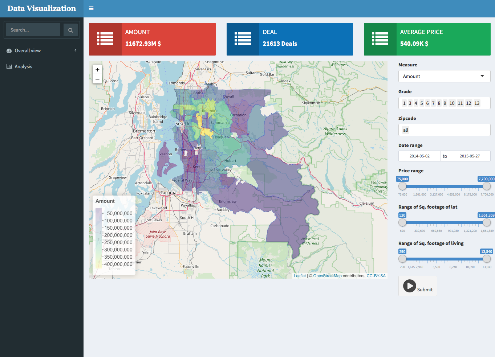
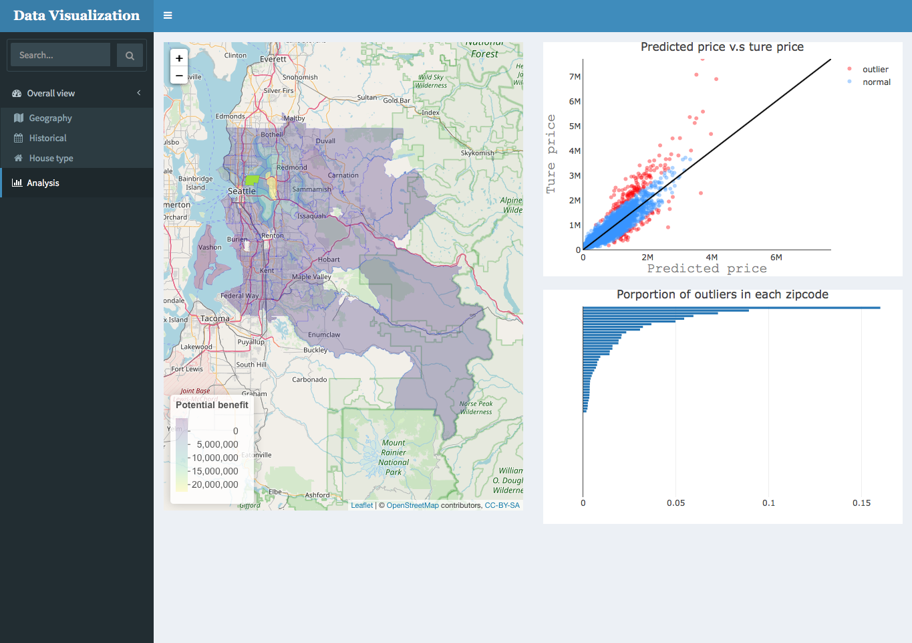
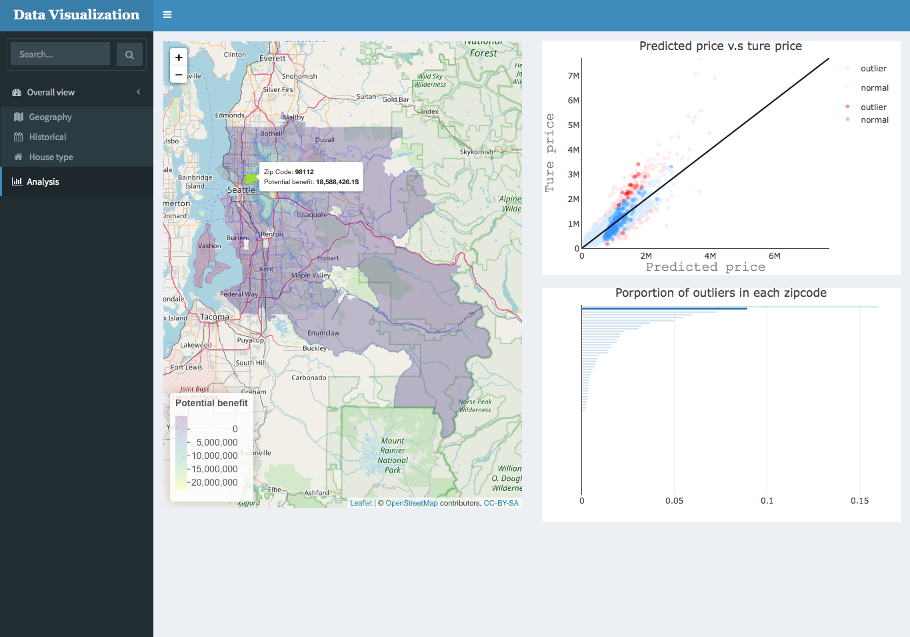
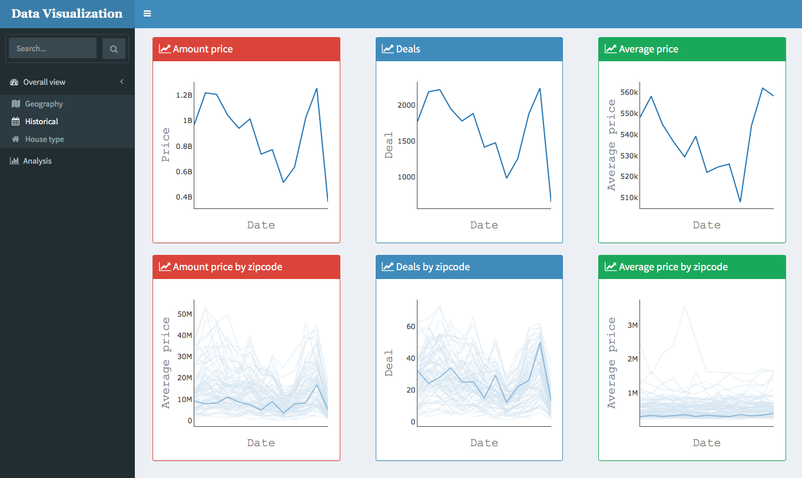
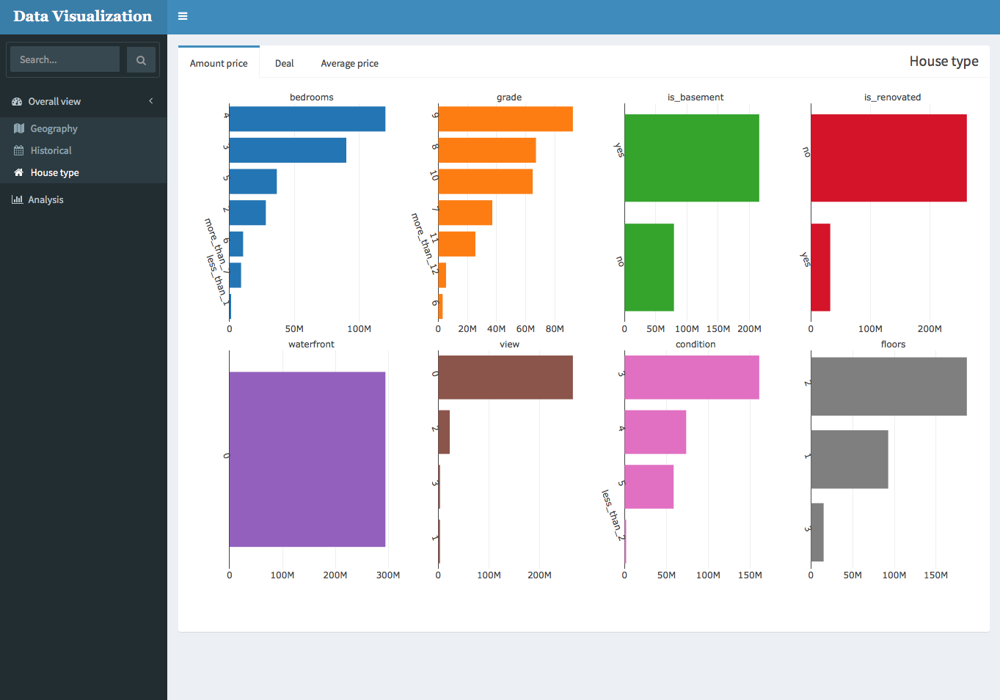
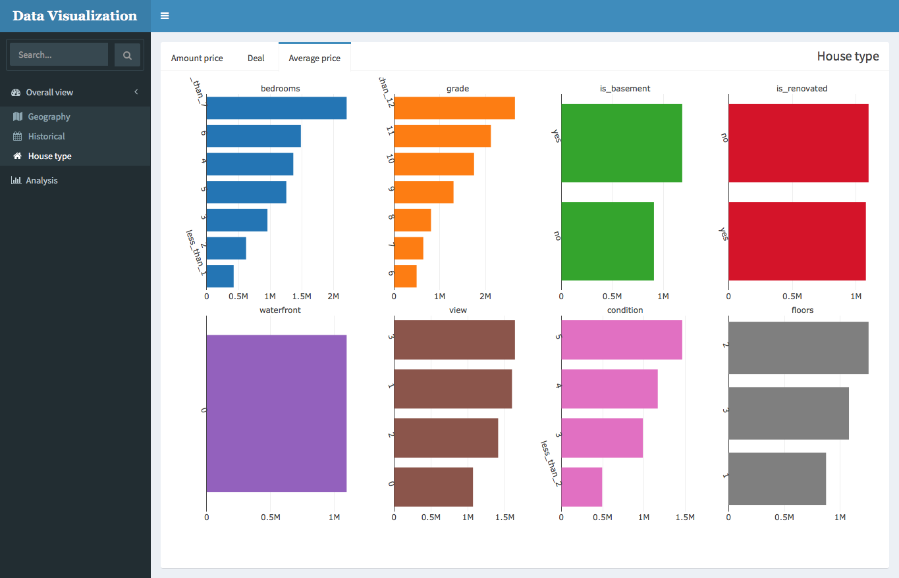

```{r setup, include=FALSE}
# Loading package
library(data.table)
library(reshape2)
library(magrittr)
library(plyr)
library(dplyr)
library(dtplyr)
library(tidyr)
library(purrr)
library(pipeR)
library(stringi)
library(stringr)
library(lazyeval)
library(rCharts)
library(xml2, warn.conflicts = FALSE)
library(rlist, warn.conflicts = FALSE)
library(fasttime, warn.conflicts = FALSE)
library(mongolite, warn.conflicts = FALSE)
library(ggplot2)
library(parallel)
library(doSNOW)
library(foreach)
library(ggpubr)
library(rmarkdown)
library(randomForest)
library(rpart)
library(knitr)
library(GGally)
library(dbscan)
# render("DataAnalystChallenge.Rmd")

# Note that the `echo = FALSE` parameter was added to the code chunk to prevent printing of the R code that generated the plot.

# reference 
rpart.predict.leaves <- function (rp, newdata, type = "where")
{
#
# With a tip of the hat to Yuji at
# http://stackoverflow.com/questions/5102754/
# search-for-corresponding-node-in-a-regression-tree-using-rpart
#
if (type == "where") {
    rp$frame$yval <- 1:nrow(rp$frame)
    should.be.leaves <- which(rp$frame[, 1] == "<leaf>")
} else if (type == "leaf") {
    rp$frame$yval <- rownames(rp$frame)
    should.be.leaves <- rownames(rp$frame)[rp$frame[, 1] == "<leaf>"]
}
else stop ("Type must be 'where' or 'leaf'")
#
# Sometimes -- I don't know why -- the rpart.predict() function will
# give back a "leaf membership" that's not a leaf. See if that's true.
#
leaves <- predict(rp, newdata = newdata, type = "vector")
should.be.leaves <- which (rp$frame[,1] == "<leaf>")
bad.leaves <- leaves[!is.element (leaves, should.be.leaves)]
if (length (bad.leaves) == 0)
    return (leaves)
#
#
# If we got here there are some elements of "leaves" that are not in
# fact leaves. Strictly we should visit the most populous of its children,
# then the most populous of *that* node's children, and so on until we got
# to a leaf. But in fact we'll just choose the most populous leaf underneath
# our landing point.
#
# "Leaves" are row numbers in the rpart frame. "Nodes" are actual node
# numbers -- also row *names* in the rpart frame. We'll need both.
#
u.bad.leaves <- unique (bad.leaves)
u.bad.nodes <- row.names (rp$frame)[u.bad.leaves]
all.nodes <- row.names (rp$frame)[rp$frame[,1] == "<leaf>"]
#
# We'll make use of this function, which given a vector of leaf numbers
# produces a logical of the same length whose ith entry is TRUE if that
# leaf number is a descendant of node.
#
is.descendant <- function (all.leaves, node) {
#
# If no leaves are given, get out. Convert the others to numeric, because
# they may have started as row numbers.
#
if (length (all.leaves) == 0) return (logical (0))
all.leaves <- as.numeric (all.leaves); node <- as.numeric (node)
if (missing (node)) return (NA)
#
# Set up result. Then loop over leaf indices. For each one just keep
# computing trunc(thing/2) until it's equal to node. If it gets there,
# it's a descendant. If it gets to be < node, it isn't. Quit.
#
result <- rep (FALSE, length (all.leaves))
for (i in 1:length (all.leaves)) {
    LEAF <- all.leaves[i]
    while (LEAF > node) { 
        LEAF <- trunc (LEAF/2) 
        if (LEAF == node) result[i] <- TRUE
        break
    }
}
return (result)
}
#
# Okay. Look through each unique bad entry in u.nodes. For each
# one, figure out which leaves are its descendants, then consult
# the table of leaves to find out the most populous of the entries
# associated with descendants (in the training set, as recorded
# in the tree's "where" entry). Set the relevant indices of  "leaves." 
#
# Remember that "where.tbl" has some shaky entries in it -- the very
# ones we're here to remove.
#
where.tbl <- table (rp$where)
names (where.tbl) <- row.names (rp$frame)[as.numeric (names (where.tbl))]
#
# Loop over the set of nodes that aren't leaves but think they are.
#
for (u in 1:length (u.bad.nodes)) {
    desc.vec <- is.descendant (all.nodes, u.bad.nodes[u])
#
# Use "all.nodes" to extrac from where.tbl only those entries that
# belong to legitimate leaves. Then pull out the descendants.
#
    me <- where.tbl[all.nodes][desc.vec]
#
# Find the maximal entry, grab its name. The [1] breaks ties.
#
    winner <- names (me)[me == max(me)][1]
    leaves[leaves == u.bad.leaves[u]] <- which (row.names (rp$frame) == winner)
}
return (leaves)
}


```

```{r loading_data, echo=FALSE}
df_house <- fread('./data/kc_house_data.csv') %>>%
  `[`(, date:=as.Date(str_extract(date, '(\\d){8}'), format='%Y%m%d'))
```

# Question 1.
The average price is 
```{r question1}
mean(df_house$price)
```

# Question 2.
Before I calcualte the price per bathroom and per bedroom, I look at how many records have 0 for bedroom or bathroom.

There are only 16 records. Hence, I just ignore these 16 records in this question. 

```{r question2_1}
df_tmp <- df_house[bedrooms>0 & bathrooms>0]
nrow(df_house) - nrow(df_tmp)
```

Then, I create two columns for the price per bedroom and per bathroom for each record, and calculate their averages.
```{r question2_2}
df_tmp[, `:=`(price_per_bedroom = price/bedrooms, 
              price_per_bathroom = price/bathrooms)]
```

```{r question2_3, echo = FALSE, size = "tiny", fig.width=7, fig.height=3.5}
# the average of price per bedroom
cat('The average of price per bedroom: ', mean(df_tmp$price_per_bedroom), '\n')

gd <- density(df_tmp$price_per_bedroom)
ggplot() +
  geom_line(aes(x=gd$x, y=gd$y), color='#999999', alpha=0.8) + 
  geom_area(aes(x=gd$x, y=gd$y), fill='#999999', alpha=0.5) + 
  geom_vline(xintercept = mean(df_tmp$price_per_bedroom),
             show.legend = NA, color='#FF0000', linetype='dashed') +
  annotate('text', 
           x=mean(df_tmp$price_per_bedroom), 
           y=max(gd$y), 
           label=paste('Mean: ', round(mean(df_tmp$price_per_bedroom)/1000, 2), 'K', sep='')
           ) + 
  theme_classic() + 
  labs(title="Density of price per bedroom",x="Price", y = "Density")
```

```{r question2_4, echo = FALSE, size = "tiny", fig.width=7, fig.height=3.5}
# the average of price per bathroom
cat('The average of price per bathroom: ', mean(df_tmp$price_per_bathroom), '\n')

gd <- density(df_tmp$price_per_bathroom)
ggplot() +
  geom_line(aes(x=gd$x, y=gd$y), color='#999999', alpha=0.8) + 
  geom_area(aes(x=gd$x, y=gd$y), fill='#999999', alpha=0.5) + 
  geom_vline(xintercept = mean(df_tmp$price_per_bathroom),
             show.legend = NA, color='#FF0000', linetype='dashed') +
  annotate('text', 
           x=mean(df_tmp$price_per_bathroom), 
           y=max(gd$y), 
           label=paste('Mean: ', round(mean(df_tmp$price_per_bathroom)/1000, 2), 'K', sep='')
  ) + 
  theme_classic() + 
  labs(title="Density of price per bathroom",x="Price", y = "Density")
```

By looking at the density function, the price per bedroom and per badroom are right-skewed.
That means there are quite a lot of data with extremely high prices per each attribute. 
As a result, it is not suitable to use the average price to represent the whole data because there are still a lot of data with far higher values than the average.

The boxplot of price per bedroom by number of bedrooms below not only shows the distribution of price, but also shows outliers (red points) and the average (blue point) for each case. We notice there are a lot of outliers from the 2-bedroom case to the 6-bedroom case, which cause the problem I mentioned above.

```{r question2_5, echo = FALSE, size = "tiny", fig.width=7, fig.height=3.5}
ggplot(df_tmp, aes(x=factor(bedrooms), y=price_per_bedroom)) + 
  geom_boxplot(outlier.colour='red', outlier.fill='red')+
  stat_summary(fun.y = mean, geom="point",colour="#3399FF", size=1) +
  labs(title="Price per bedroom v.s Number of bedrooms",x="Number of bedrooms", y = "Price per bedroom")+
  theme_classic()
```

Hence, we need to segment the data in these cases using the attribute (sqft_living) which is the most important variable when I use a random forest algorithm to classify whether they are outliers of boxplots in these cases.

After segmenting the data, we get 4 different classes.

1. Class 1: the number of bedroom is not between 2 and 6.
2. Class 2: the number of bedroom is between 2 and 6, and sqft_living < 3855
3. Class 3: the number of bedroom is between 2 and 6, and sqft_living >= 4805
4. Class 4: the number of bedroom is between 2 and 6, and 3855 <= sqft_living < 4805

The following graph shows a boxplot by class, and the table shows the average price per bedroom as well as the number of samples in each class. As we can see, most of data in the class 2. 

In each class, the distribution becomes less right-skewed compared to the overall distribution if we ignore the extremes. The boxplot also points out the average price (blue point) for each class. Because the distribution becomes more symmetrical, we can use the average price to represent the overall price per bedroom because the distance between the average price and outliers is smaller in the new class than when we just use the number of bedroom as the class, although there are still some outliers in each class but the percentage of outliers is smaller than before segmentation.

```{r question2_6, echo = FALSE, size = "tiny", fig.width=7, fig.height=3.5}
df_tmp1 <- df_tmp[bedrooms %in% c(2, 3, 4, 5, 6)]
vals <- boxplot(df_tmp1$price_per_bedroom, plot=F);
df_tmp1$class <- ifelse(df_tmp1$price_per_bedroom >= min(vals$out), 'outlier', 'normal')
df_tmp1[, `:=`(
  grade=factor(grade),
  waterfront=factor(waterfront),
  view=factor(view),
  condition=factor(condition),
  class = factor(class)
)]

# model_rf <- randomForest(class ~ grade + waterfront + view + condition + 
#                sqft_living + sqft_lot + floors + sqft_above + sqft_basement + 
#                  sqft_living15 + sqft_lot15, 
#              data=df_tmp1, keep.forest=T, importance=T)
# 
# variable_name <- rownames(importance(model_rf))
# importance(model_rf) %>>% as.data.table %>>% 
#   `[`(, variable:=variable_name) %>>% setorderv('MeanDecreaseGini', -1) %>>% {.[]}

set.seed(8675309)
rpart_fit <- rpart(class~sqft_living, 
                   data = df_tmp1, method='class',
                   control=rpart.control(minsplit=100, maxdepth=3, cp=0.0001))


df_tmp$tmp_split <- ifelse(df_tmp$bedrooms %in% c(2, 3, 4, 5, 6), 'yes', 'no')
df_tmp <- df_tmp %>>% split(df_tmp$tmp_split)
# df_tmp$no$class <- mapvalues(df_tmp$no$bedrooms, unique(df_tmp$no$bedrooms), rank(unique(df_tmp$no$bedrooms)))
df_tmp$no$class <- 1
df_tmp$yes$class <- rpart.predict.leaves(rpart_fit, df_tmp$yes, type = "where") %>>%
  mapvalues(unique(.), c(2, 3, 4))

df_tmp <- df_tmp %>>% rbindlist()

df_tmp[, .(bedroom = mean(price_per_bedroom), N=.N), by=.(class)] %>>% 
  setorderv('class', 1) %>>%
  kable()

ggplot(df_tmp, aes(x=factor(class), y=price_per_bedroom)) + 
  geom_boxplot(outlier.colour='red', outlier.fill='red')+
  stat_summary(fun.y = mean, geom="point",colour="#3399FF", size=1) +
  labs(title="Price per bedroom v.s Class",x="Class", y = "Price per bedroom")+
  theme_classic()

```

After discussing the segmentation method, we can start to explore these two types of prices together. 

Firstly, I plot the scatter plot for the price per bathroom and per bedroom to see their joint distribution. Their marginal distributions are also ploted. 

```{r question2_7, echo = FALSE, size = "tiny", fig.width=7, fig.height=3.5}
sp <- ggscatter(df_tmp, x='price_per_bedroom', y='price_per_bathroom',
          color='#333333', 
          size=3, alpha=0.4
          ) + 
  geom_hline(yintercept = mean(df_tmp$price_per_bathroom),
             show.legend = NA, color='#FF0000', linetype='dashed') + 
  geom_vline(xintercept = mean(df_tmp$price_per_bedroom),
             show.legend = NA, color='#FF0000', linetype='dashed') +
  labs(x = 'Price per bedroom', 
       y = 'Price per bathroom') + 
  xlim(0, max(c(max(df_tmp$price_per_bathroom), max(df_tmp$price_per_bedroom)))) + 
  ylim(0, max(c(max(df_tmp$price_per_bathroom), max(df_tmp$price_per_bedroom)))) + 
  border()
xplot <- ggdensity(df_tmp, 'price_per_bedroom', fill='#333333', alpha=0.4) + clean_theme()
yplot <- ggdensity(df_tmp, 'price_per_bathroom', fill='#333333', alpha=0.4) + coord_flip()  + clean_theme()

ggarrange(xplot, NULL, sp, yplot,
          ncol = 2, nrow = 2,  align = "hv",
          widths = c(2, 1), heights = c(1, 2),
          common.legend = TRUE)
```

In the density plots of the graph below, they show the same thing as above.

From the scatter plot, we can realise these two prices have positive correlation. Also, I highlight their averages by red dashed lines in this graph.

However, there are several different levels of correlation among the data.
It is better for us to segmant data in terms of the relationship between the two types of prices. 
Also, we can realize what are the levels of these two prices if they have the different levels of relations.

Secondly, we can fit a simple regression model for the price per bedroom and price per bathroom. Then, I use the fitted residuals of the regression to segment the data by kMeans clustering with 3 clusters.

We can see there are 3 different clusters in the scatter plot below, which demonstrates 3 different types of relationship between the price per bathroom and per bedroom. If we look back at their marginal distributions, the data is also segmented by the different levels of prices. 

Now, we can illustrate how the relation between the price per bedroom and the price per bathroom changes based on their prices.

1. From the density plots, the data in cluster 1 has relatively higher price per bedroom and per bathroom. In this cluster, the price per bathroom increases relatively lower when the price per bedroom increases by 1 unit. 
2. From the density plots, the data in cluster 2 has the middle price per bedroom, but the low price per bathroom. The increasing ratio in this cluster are between the clustr 1 and cluster 3.
3. From the denstiy plots, the data in cluster 3 has the relatively lower price per bedroomm, and the middle price per bathroom. In this cluster, the price per bathroom increases relatively higher when the price per bedroom increases by 1 unit. 

```{r question2_8, echo = FALSE, size = "tiny", fig.width=7, fig.height=3.5}
set.seed(8675309)
fit <- lm(price_per_bedroom ~ price_per_bathroom, data=df_tmp)
df_tmp$cluster <- kmeans(fit$residuals, 3) %>>% {.$cluster} %>>% as.factor()

df_tmp <- df_tmp[, .(price_per_bedroom=mean(price_per_bedroom), 
                     price_per_bathroom=mean(price_per_bathroom)), by=.(cluster)] %>>%
  setorderv(c('price_per_bedroom', 'price_per_bathroom'), c(-1, -1)) %>>%
  `[`(, new_cluster:=as.factor(.I)) %>>%
  `[`(, c('cluster', 'new_cluster'), with=F) %>>% merge(df_tmp, by='cluster', all.x=F, all.y=T) %>>%
  `[`(, cluster:=new_cluster) %>>% `[`(, new_cluster:=NULL)

sp <- ggscatter(df_tmp, x='price_per_bedroom', y='price_per_bathroom',
                color = "cluster", palette = "jco",
                size=3, alpha=0.4
) + 
  labs(x = 'Price per bedroom', 
       y = 'Price per bathroom') + 
  xlim(0, max(c(max(df_tmp$price_per_bathroom), max(df_tmp$price_per_bedroom)))) + 
  ylim(0, max(c(max(df_tmp$price_per_bathroom), max(df_tmp$price_per_bedroom)))) + 
  border()
xplot <- ggdensity(df_tmp, 'price_per_bedroom', fill = "cluster",palette = "jco", alpha=0.4) + clean_theme()
yplot <- ggdensity(df_tmp, 'price_per_bathroom', fill = "cluster",palette = "jco", alpha=0.4) + coord_flip() + clean_theme()

ggarrange(xplot, NULL, sp, yplot,
          ncol = 2, nrow = 2,  align = "hv",
          widths = c(2, 1), heights = c(1, 2),
          common.legend = TRUE)
```

The table below shows the average of price per bedroom and price per bathroom and the number of data for each cluster.

```{r question2_9, echo = FALSE, size = "small"}
df_tmp[, .(bedroom=mean(price_per_bedroom),
           bathroom=mean(price_per_bathroom),
           number_data = .N
           ), by=.(cluster)] %>>% setorderv('cluster', 1) %>>% kable()
```


# Question 3.

For this question, I am going to use a linear regression model which I build in the question 5, and then, look at the residuals to find out outliers if a model is realiable. 

But in this case, we don't need to separate training data and testing data because our target is to find outliers based on a linear regression model. I will show the way to build a linear regression model is realiable in the question 5. The process to build a linear regression model is shown below.

```{r question3_1, echo = TRUE, size = "small"}
# loading data
df_house <- fread('./data/kc_house_data.csv') %>>%
  `[`(, date:=as.Date(str_extract(date, '(\\d){8}'), format='%Y%m%d'))

# manipulate a dataset for a model
df_house <- df_house %>>% 
  `[`(, `:=`(
    bedrooms = factor(ifelse(bedrooms >= 7, 'more_than_7', 
                             ifelse(bedrooms<=1, 'less_than_1', bedrooms))),
    grade = factor(ifelse(grade<=4, 'less_than_4', 
                          ifelse(grade>=12, 'more_than_12', grade))),
    is_basement = factor(ifelse(sqft_basement==0, 'no', 'yes')),
    is_renovated = factor(ifelse(yr_renovated==0, 'no', 'yes')),
    zipcode = as.factor(zipcode),
    waterfront = as.factor(waterfront),
    view = as.factor(view),
    condition = as.factor(ifelse(condition <= 2, 'less_than_2', condition)),
    floors = as.factor(floor(floors))
  ))
# take the certain column
df_tmp <- df_house[, c('price', 'sqft_lot', 'sqft_living', 
                       'bedrooms', 'grade', 'is_basement', 
                       'is_renovated', 'zipcode', 'waterfront', 
                       'view', 'condition', 'floors'), with=F]
# linear regression
# remove samples with extremely large values of sqft_living or sqft_lot
model_lm <- lm(price ~ ., data=df_tmp[sqft_living < 13540 & sqft_lot < 1651359])
lm_summary <- summary(model_lm)
```

```{r question3_2, echo = FALSE, size = "small"}

# variables
cat('Variables: \n')
colnames(df_tmp)
# model
cat('Linear regression model: \n')
lm_summary$call
# R square
cat('R square: \n')
lm_summary$r.squared
# Adjusted R square
cat('Adusted R squre: \n')
lm_summary$adj.r.squared
```

Then, I apply density-based clustering to resisuals calculated by fitted values and true values. There are two parameters we need to set up for density-based clustering, size of the epsilon neighborhood and number of minimum points in the eps region (for core points). 
For size of the epsilon neighborhood, I use 1.5 $\times$ the interquartile range(IQR) based on the absolute residuals; for number of minimum points in the eps region, I set 0.01 $\times$ the number of samples because I suggest a residual will be treated as outliers if there are less than 1% of total sample size close to it.

```{r question3_3, echo = TRUE, size = "small"}
# set the parameters for density-based clustering
df_tmp$fitted_price <- predict(model_lm, df_tmp)
dbscan_eps <- quantile(abs(df_tmp$price - df_tmp$fitted_price), c(0.25, 0.75)) %>>% diff() %>>% {.*1.5}
residuals <- (df_tmp$price - df_tmp$fitted_price) %>>% as.matrix()

dbc <- dbscan(residuals, eps = dbscan_eps, minPts = floor(0.01*nrow(df_tmp)))

df_tmp$is_outlier <- ifelse(dbc$cluster!=0, 1, 0) %>>% factor(levels=c(0, 1), labels=c('outlier', 'normal'))

df_tmp$row_id <- seq(1, nrow(df_tmp), by=1)
df_tmp$residual <- df_tmp$price - df_tmp$fitted_price
```

The first graph below indicates density-based clustering treats the residuals which are far from 0 as outliers, and the second graph below indicates the points are far from a diagonal line as outliers, which means they have relatively higher residuals. 

```{r question3_4, echo = FALSE, size = "small", fig.width=7, fig.height=3.5}
ggplot(df_tmp, aes(x=row_id, y=residual, color = is_outlier)) +
  geom_point(shape = 16, size = 1, show.legend = T, alpha = 0.6) +
  theme_classic() +
  labs(y="Residuals", x = "Index", title='Scatter plot for residuals') +
  scale_colour_discrete(name  = "Type")
```

```{r question3_5, echo = FALSE, size = "small", fig.width=5, fig.height=5}
x_max <- max(max(df_tmp$price), max(df_tmp$fitted_price))
ggplot(df_tmp, aes(x=fitted_price, y=price, color = is_outlier)) +
  geom_point(shape = 16, size = 1.5, show.legend = T, alpha=0.6) + 
  geom_abline(intercept = 0, slope=1, color='#CC0033', linetype='dashed') + 
  xlim(0, x_max) + 
  ylim(0, x_max) + 
  theme_classic() +
  labs(x="Fitted price", y = "Price", title='Scatter plot for Fitted price v.s Price') +
  scale_colour_discrete(name  = "Type")

```

The ids of outliers are listed below. 

```{r question3_6, echo = FALSE, size = "small", fig.width=5, fig.height=5}
cat('Number of outliers:\n')
sum(df_tmp$is_outlier == 'outlier')

cat('Outlier list:\n')
df_house$id[df_tmp$is_outlier == 'outlier']
```

# Question 4.

This part is done by Shiny Application, [https://yu8861213.shinyapps.io/Cheng_ShinyApp/](https://yu8861213.shinyapps.io/Cheng_ShinyApp/).

When you open the Shiny application, please click "submit". 

```{r, echo = FALSE, out.width = '80%', out.height='80%', fig.cap="\\label{fig:figs}"}
#knitr::opts_chunk$set(fig.pos = 'H')

```

THen, go to the Analysis page. In this part, I use a regression model which I build for the question 5 to figure out outliers, which I utilise the idea of the quesiotn 3.

In the scatter plot of Figure 2, we can see some red points (outliers) are far from the diagonal line, which means their predicted prices are too greater or too lower than their ture prices. This implies some of these points have potential profit if their ture prices are too greater than their predicted prices because the predicted prices are what their prices should be based on the regression model. Therefore, we need to find out which areas based on zipcodes have a lot of this kind of deals. 

```{r, echo = FALSE, out.width = '80%', out.height='80%', fig.cap="\\label{fig:figs}"}

```

For this purpose, we can look at the bar chart and click the second one (zipcode: 98112) which means it has the high percentage(8.92%) of this kind of points in order to highlight this area on our graphs. In this area, there are about half of outlier deals with ture prices more than predicted prices. Also, if we look at the map, we will realize its potential profit is 18,588,426$ during the period we consider in our dataset which is calculated by the sum of difference between ture prices and predicted prices, shown in Figure 3.

```{r, echo = FALSE, out.width = '90%', out.height='90%', fig.cap="\\label{fig:figs}"}

```

Then, we can turn to the historical trades which in the Historical page of Overall view to observe its trends.
In this area, we realise that the trend of amount price and number of deals are similar to the overall trend, but the trend of average price for each deal are increasing stably compared to the overall trend of average price, shown in Figure 4.

```{r, echo = FALSE, out.width = '90%', out.height='90%', fig.cap="\\label{fig:figs}"}

```

In this area, its total price is 294.69M dollars, the number of deals is 269, and the average price is 1095.5K dollars from 2014-5-2 to 2015-5-27, shown in Figure 5.

```{r, echo = FALSE, out.width = '90%', out.height='90%', fig.cap="\\label{fig:figs}"}

```

Now, we can look at the type of houses in this area if we go to the House type page of Overal view, Shown in Figure 6.

```{r, echo = FALSE, out.width = '90%', out.height='90%', fig.cap="\\label{fig:figs}"}

```

From this page, we can understand what kind of house types are popular. Moreover, we are able to explore different measures( total price, number of deals, and average price). In this session, I would like to descirbe the average price more because we saw its average price is increasing. If we can understand what type of houses can have a higher price in this area(zipcode=98112), they are worth investing.

According to Figure 7, houses with more than 7 bedrooms, grade higher than 11, basement, view = 1 or 3, condition = 5, 2 floors have a greater price; this kind of houses is worth buying because they have higher prices and their prices will increase stably as we see above. 

```{r, echo = FALSE, out.width = '90%', out.height='90%', fig.cap="\\label{fig:figs}"}

```

To sum up, we look at outliers based on the realiable model firstly in order to find out a area with potential profit. Secondly, after comparing its trend of amount of price, number of deals, average price to the overall trends, we understand which measure we are going to use to find out the types of houses with potential profit in the area; here, the average of price is chosen. Finally, we observe the average of price for different conditions of house, and figure out what the kind of houses we should buy in this area. 


# Question 5.

Because the data has 21 columns, including price, we should select the certain columns to train a regression model. I am going to consider 13 columns as my variables, bedrooms, sqft_living, sqft_lot, floors, waterfront, view, condition, grade, sqft_above, sqft_basement, yr_renovated, zipcode, sqft_living15,and sqft_lot15.

Firstly, we need to decide which column is numerical and categorical. According to their distinct value. According to the number of distinct value for each variable, I decide to treat bedrooms, grade, yr_renovated, waterfront, view, condition, and floors as categorical variables. Moreover, there are more than 50% data with sqft_basement = 0.
I make a new categorical variable is_basement(is sqft_basement == 0) to replace sqft_basement. This way is also applied to a variable yr_renovated, which I create a new categorical variable is_renovated(yr_renovated==0).
After that, we need to look at other categorical variables because some of them have the certain values with few samples which will cause a sparsity problem during model training. 

```{r question5_1, echo=FALSE}
df_house <- fread('./data/kc_house_data.csv') %>>%
  `[`(, date:=as.Date(str_extract(date, '(\\d){8}'), format='%Y%m%d'))

# df_house %>>% sapply(function(x){length(unique(x))})
```

Because there are only 62 samples with bedrooms greater than or equal to 7 and 212 samples with bedrooms less than or equal to 1, we can create new categories more_than_7 and less_than_1. 

```{r question5_2, echo=FALSE, size='small'}
cat('distinct count of bedrooms\n')
df_house$bedrooms %>>% table
```

Because there are only 103 samples with grade greater than or equal to 12 and 33 samples with grade less than or equal to 4, we can create new categories more_than_12 and less_than_4. 

```{r question5_3, echo=FALSE, size='small'}
cat('distinct count of grade\n')
df_house$grade %>>% table
```

Because there are only 202 samples with condition greater than or equal to 12, we can create a new category less_than_2. 

```{r question5_4, echo=FALSE, size='small'}
cat('distinct count of condition\n')
df_house$grade %>>% table
```

For the variable floors, we can merge 1.5 into 1, 2.5 into 2, 3.5 into 3 because there are not many samples in these categories.

```{r question5_5, echo=FALSE, size='small'}
cat('distinct count of floors\n')
df_house$floors %>>% table
```


Next, we turn our attention to numerical variables, sqft_living, sqft_lot, sqft_above, sqft_living15, and sqft_lot15. If we select sqft_living, we should only take sqft_lot15 into our model because sqft_above and sqft_living15 have high correlation with sqft_living, as the graph below shows. Otherwise, we will suffer from a collinear problem which makes a regression model unstable.

```{r question5_6, echo=FALSE, size='small', fig.width=5, fig.height=5}
ggpairs(df_house[, c('sqft_living', 'sqft_lot', 'sqft_above', 'sqft_living15', 'sqft_lot15'), with=F])
```

However, there are two samples with extremely large sqft_living = 13540 and sqft_lot = 1651359. We need to get rid of these two data points before fitting a regression model.

```{r question5_7, echo=FALSE, size='small', fig.width=5, fig.height=5}
cat('sqft_living\n')
df_house$sqft_living %>>% summary

cat('sqft_lot\n')
df_house$sqft_lot %>>% summary
```

The code blow shows how I prepare data for a regression model.

```{r question5_8}
df_house <- df_house[sqft_living < 13540 & sqft_lot < 1651359] %>>% 
  `[`(, `:=`(
  bedrooms = factor(ifelse(bedrooms >= 7, 'more_than_7', 
                           ifelse(bedrooms<=1, 'less_than_1', bedrooms))),
  grade = factor(ifelse(grade<=4, 'less_than_4', 
                        ifelse(grade>=12, 'more_than_12', grade))),
  is_basement = factor(ifelse(sqft_basement==0, 'no', 'yes')),
  is_renovated = factor(ifelse(yr_renovated==0, 'no', 'yes')),
  zipcode = as.factor(zipcode),
  waterfront = as.factor(waterfront),
  view = as.factor(view),
  condition = as.factor(ifelse(condition <= 2, 'less_than_2', condition)),
  floors = as.factor(floor(floors))
))

# this is a dataset we're going to use 
df_tmp <- df_house[, c('price', 'sqft_lot', 'sqft_living', 
                       'bedrooms', 'grade', 'is_basement', 
                       'is_renovated', 'zipcode', 'waterfront', 
                       'view', 'condition', 'floors'), with=F]
```

Now, we can start to train a regression model. At the beginning, I split data into training and testing data. For safety, I apply 10-fold cross-validation to training data in order to make sure our model is able to achieve the certain levels of R square and adjusted R square. 

The table below just shows this regression model is quite stable and has great performance because the results of R2 and adjust R2 from 10-fold cross-validation stay in about 0.8.

```{r question5_9, echo=FALSE, size='small'}
set.seed(Sys.time())
row_id <- seq(1, nrow(df_tmp), by=1)

select_id <- sample(row_id, size=round(nrow(df_tmp)*0.7), replace=F)
df_train <- df_tmp[select_id]
df_test <- df_tmp[-select_id]

## 10-fold cross validation
cv_i <- sample(c(1:10), size=nrow(df_train), replace=T)
cv_result <- llply(c(1:10), function(i){
  df_train_train <- df_train[cv_i != i]
  df_train_validate <- df_train[cv_i == i]
  
  model_lm <- lm(price ~ .,data=df_train_train)
  r2 <- sum((predict(model_lm, df_train_validate) -      df_train_validate$price)^2)/(var(df_train_validate$price)*nrow(df_train_validate))
  
  adjust_r2 <- r2 * (nrow(df_train_validate) - 1) / (nrow(df_train_validate) - 1 - length(model_lm$coefficients))
  return(data.table(R2 = 1-r2, adjust_R2 = 1-adjust_r2))
}) %>>% rbindlist()

kable(cv_result, caption = 'Result of 10-fold cross validation')
```

Therefore, we can build a regression model with the training data and apply this model to the testing data. The performace is similar to the result we get from 10-fold cross validation.

```{r question5_10, echo=FALSE, size='small'}

model_lm <- lm(price ~ .,data=df_train)
r2 <- sum((predict(model_lm, df_test) - df_test$price)^2)/(var(df_test$price)*nrow(df_test))
adjust_r2 <- r2 * (nrow(df_test) - 1) / (nrow(df_test) - 1 - length(model_lm$coefficients))
r2 <- 1 - r2
adjust_r2 <- 1 - adjust_r2

lm_summary <- summary(model_lm)

cat('Variables:\n')
colnames(df_train)
cat('Regression Model:\n')
lm_summary$call

data.table(type=c('training', 'testing'), R2=c(lm_summary$r.squared, r2), adjust_R2=c(lm_summary$adj.r.squared, adjust_r2)) %>>% kable(caption = 'Performance of regression model')

```

Also, we can visualise the real price and predicted price of regression model from the testing data by scatter plot. It displays the real value and predicted value are closed to a diagonal line, which means this model is useful.

```{r question5_11, echo=TRUE, size='small'}
df_test$predicted_price <- predict(model_lm, df_test)

x_max <- max(max(df_test$price), max(df_test$predicted_price))

ggplot(df_test, aes(x=predicted_price, y=price)) +
  geom_point(shape = 16, size = 1.5, show.legend = FALSE, alpha=0.5) + 
  geom_abline(intercept = 0, slope=1, color='#CC0033', linetype='dashed') + 
  xlim(0, x_max) + 
  ylim(0, x_max) +
  labs(title = 'Predicted price v.s Price on testing data',
       y = 'Price', 
       x = 'Predicted price') +
  theme_classic() 
```

The summary of model is shown below.
```{r question5_12, echo=FALSE, size='small'}
lm_summary
```


